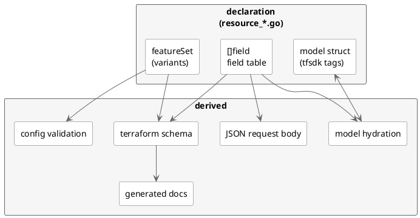

<!--
Copyright E. Breuninger GmbH & Co 2026
SPDX-License-Identifier: MPL-2.0
-->

# Provider structure

A resource is a **declaration, not an implementation**. It supplies a field
table, a model struct and — if Pulp serves it per plugin — a `featureSet`.
Everything else is derived.

| file               | role                                                  |
| ------------------ | ----------------------------------------------------- |
| `resource_*.go`    | one declaration per resource                          |
| `fields.go`        | `field` table → schema, request body, hydration       |
| `features.go`      | which `content_type/plugin_name` variants Pulp serves |
| `resource_base.go` | `pulpResource[M]`, the CRUD lifecycle resources share |

## Adding an attribute

Two lines, in the same resource file:

1. A `field{}` entry in the resource's table.
2. A matching `tfsdk`-tagged member on its model.

`Name` is the Pulp field name and doubles as the terraform attribute, the
request body key and the response key. Set `Feature` if only some variants
accept the attribute; it is then gated out of the request body and rejected at
plan time elsewhere, and the docs say where it applies.

### The flags

`Optional`, `Required` and `Computed` are terraform's: they say what a
practitioner may write. The rest describe Pulp, and answer different
questions:

| flag          | question                                               |
| ------------- | ------------------------------------------------------ |
| `Nullable`    | outbound: what do we send when the config omits it?    |
| `EmptyIsNull` | inbound: how does Pulp report "unset"?                 |
| `ReadOnly`    | outbound: never send it, Pulp assigns it               |
| `WriteOnly`   | inbound: never read it, Pulp never returns it          |
| `Local`       | neither: it picks the endpoint, Pulp does not store it |

`Nullable` only matters once an attribute is `Optional`, and only when a
practitioner _removes_ it. Without it the key is left out of the PATCH, which
Pulp reads as "leave it alone" — the old value survives and drifts forever.
With it we send an explicit `null` and Pulp clears the field. It must match the
API: Pulp rejects a null on a non-nullable field with "This field may not be
null."

`EmptyIsNull` is the inbound mirror. Pulp reports some unset fields as `""`
rather than omitting them; read literally, state would hold `""` where the
config holds nothing, and every plan would show a diff.

An `Optional` + `Computed` attribute is unknown, not null, when it is absent
from the config, and unknown is always omitted from the body — so `Nullable`
only bites on a plain `Optional` attribute. `EmptyIsNull` applies to strings
only.

## Adding a resource

Declare a model and a type embedding `pulpResource[Model]`, then register it in
`provider.go`. Override `resourcePath` only if it does not POST to a plain
collection, and `afterHydrate` only for values that must be derived rather than
read from the response.

Resources that are not CRUD-on-href — `pulp_object_role`, which reconciles
through `add_role`/`remove_role` — are written by hand.

## Adding a Pulp plugin

One entry in the relevant `featureSet` in `features.go`. The `OneOf`
validators, the combination check and the documented list of supported
variants all follow.

## Tests

`TestFieldTablesMatchModels` fails if a table and its model disagree by name or
type.

`TestFeatureSetsMatchAPISchema` compares every `featureSet` against Pulp's own
OpenAPI schema, read from the Pulp the acceptance tests run against
(`{PULP_SERVER_URL}/pulp/api/v3/docs/api.json`, default `localhost:8080`). It
is fetched rather than vendored so the maps are always checked against the
version actually in use: a Pulp that gains or drops a plugin fails a test
instead of surfacing as a 404 much later. The schema-reading tests skip when no
Pulp is reachable, so `go test` still works without the stack.

Acceptance tests need a running Pulp too; `make testacc` brings one up.
